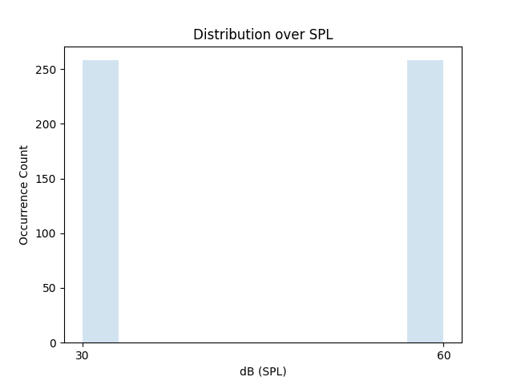
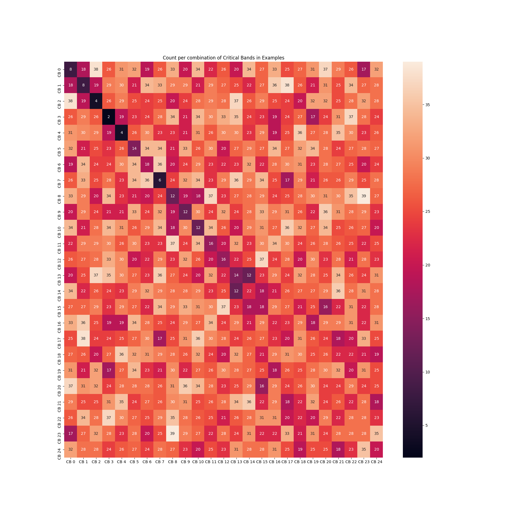

# Listening Data Generator

This library implements the generation of data for listening tests that aim to
quantify the amount of masking that happens for sounds made up of 2, 3, or 4
frequencies. It can be used to generate 3 types of data sets:

1.  ISO equal loudness reproduction examples.
2.  A dataset of examples with 2 tones. # TODO: update to reflect new
3.  A dataset of examples with 2,3, or 4 tones.

## Quick start

To generate the data for **dataset 1**:

```shell
>> python3 analysis/data_generation/iso_reproduction_generator.py
```

This will create (in a folder defined by the flag `--save_directory`) the file
`data_iso_repro.csv` and a visualization of which examples it contains in
`iso_repro.png`.

To generate the data for **dataset 2**:

```shell
>> python3 analysis/data_generation/two_tone_set_generator.py
```

This will create (in a folder defined by the flag `--save_directory`) the files
`probes_two_tone_set.csv` and `maskers_two_tone_set.csv`. The former contains
all data, which are examples of a probe with a combined tone. The latter file
contains the same examples but with the masker frequency as a probe (i.e., the
single tone that listeners are asked to adjust will be the masker frequency from
the combined tone). The command also generates heatmaps for both csv files
(which will be tranposes of eachother, since the vertical axis show the CBs of
the maskers and the horizontal one of the probes.) which are heatmaps showing
which critical bands co-occur in examples, Further plots show histograms of the
frequencies in the data, and histograms of SPLs in the data. The data from
`probes_two_tone_set.csv` and `maskers_two_tone_set.csv` can be used for
listening tests.

To generate the data for **dataset 3**:

```shell
>> python3 analysis/data_generation/listening_data_generator.py
```

This will make a folder defined by the flag `--save_directory`. This directory
will contain the data in a csv file called `data.csv` and will contain
statistics about the generated data, like histograms of the levels, phons, and
frequencies that are covered by the data. A heatmap that shows which critical
bands are combined with which other critical bands in a single example
(`cb_heatmap.png`), and more. The data from `data.csv` can be used for listening
tests.

## Background Definitions

<section class="zippy">

**Masking**

In the context of perception, masking is simply when a sensory input that might
otherwise be perceived is hidden from perception. In the context of hearing,
this depends on many factors, such as timing (a sudden loud sound can mask
subsequent - and in some cases even previous - sounds), level (loud sounds mask
more than soft sounds), and frequency (low frequencies mask higher frequencies
more often than the reverse).

</section>

<section class="zippy">

**Critical Band**

Critical band(width) represents the bandwidth of cochlear filtering defined as
roughly the bandwidth within which frequency components interact strongly, as
opposed to being treated relatively independently.

</section>

<section class="zippy">

**Level, or Sound Pressure Level (SPL)**

Level, or sound pressure level, in human hearing context, is usually measured in
dB relative 20µPa, and is denoted dbSPL. 20µPa is a simple estimation of the
lower bound of human hearing, and is of a similar level to the sound of a
mosquito 3m away from an ear.

</section>

<section class="zippy">

**Phons**

Phons is the unit with which we measure perceived loudness. Loudness, in the
context of hearing research, is the perceived level of a sound. The ISO 226
standard describes loudness as a function of frequency and level of pure sine
tones, where the loudness unit, phons, is defined to be equal to dBSPL at
1000Hz. The ISO 226 standard describes how extensive experiments have found that
different frequencies require different levels to be perceived at the same
loudness.

</section>

<section class="zippy">

**Frequency**

The frequency is the oscillations of air molecules in sound per second. The unit
of measurement of frequency is 1/seconds, which we call hertz. Humans can hear
sounds between 20 hertz and around 20,000 hertz, whereas dogs can hear sounds up
to 40,000 hertz. High notes have high frequencies and low notes have low
frequencies.

</section>

<section class="zippy">

**Beatrange**

When two frequencies that are very close to eachother, e.g., 100 and 110 Hz, are
played simultaneously, they cause a beating sensation that makes it hard to
distininguish the tones that make up the combined sound. When we make sure that
all frequencies in examples are at least a particular range apart that do not
cause a beating, we call this range the beatrange.

</section>

## The Data Distributions

### Dataset 1 - The ISO reproduction examples

**Goal of the dataset**: when presented to human listeners, this dataset should
be comparable to the results of the ISO-226 Loudness standard.

**How to use it**: specify a number of equal loudness curves (`--num_curves`) to
generate examples from and a number of examples per curve
(`--num_examples_per_loudness_curve`) and the dataset will contain that number
of examples per curve, where each example contains a probe tone and a reference
tone (e.g., 2 curves with 3 examples per curve generates 6 examples). The
reference tone is 1000 Hz and the level will be equal to the phons for that
tone. The imposed task of each example is that a human listener has to adjust
the level of the probe tone until it's perceived equally loud as the 1000 Hz
reference tone. Use the parameter `--clip_db` to specify what the maximum SPL of
an example can be.

**Example Visualization**

Below a few equal loudness curves are shown: 10 phons (bottom curve) to 100
phons (top curve). These curves define what level-frequency combinations sound
equally loud. The blue markers at each curve show the referece tone at 1000 Hz
in the examples and the red markers show the probe frequencies in this dataset.

**NOTE**: If you want to clip the SPL at 80 dB you can't generate examples for
the 80 phons curve.


### Dataset 2 - The two tone set

**Goal of the dataset**: listening test examples that can be used to create
plots for unique masker frequency, probe level pairs. The data will contain a
set of masker frequencies, each of which will be combined with a particular set
of probes (dependent on the masker frequency). A set of levels for both the
probe and maskers can be defined separately and each probe-masker pair will
contain all combinations of those levels. All examples are written to csv.

**How to use it**: Specify the number of critical bands that the maskers and
probes need to be apart (`--critical_bands_apart_masker` and
`--critical_bands_apart_probe` respectively), and which SPLs to use (as a
comma-separated string, e.g., `--probe_levels=20,30,60` and
`--masker_levels=40`). Per masker frequency apart from the probe frequencies
that will be generated based on `--critical_bands_apart_probe`, with the
parameters `--cover_n_cbs_below_masker` and `--cover_n_cbs_above_masker` you can
specify which frequencies around the masker frequency should all be used to
generate data additionally. If both those parameters are set to 0 it won't have
an effect, but if they are set to >0 more critical bands around the masker
frequency will be used to generate data (for a clear example see the heatmap
below). In this dataset each example will have a combined sound with 2 tones.
The file `probes_two_tone_set.csv` will contain as probe tones the actual probes
generated according to the chosen parameters as `single_tone`. When presented to
human listeners, the probe volume should be adjusted to be equally salient as
the same tone in the combined tone. The csv file called
`maskers_two_tone_set.csv` will contain the sample examples but now with the
masker frequency as the 'probe' (i.e., `single_tone`). This is because we also
need the salience of these tones when we learn a predictive model on the
spectral components of a combined tone. See also
`data_generation_test.test_generate_two_tone_set()` for a test that clarifies
this. The files `SPECS_probes_two_tone_set.csv` and
`SPECS_maskers_two_tone_set.csv` specify the data that are in
`probes_two_tone_set.csv` and `maskers_two_tone_set.csv` respectively. These
files show at each line the data that can be used to make masking pattern plots.
These plots will have SPL (dB) at the y-axis, probe frequencies at the x-axis,
and will contain a single curve per masker SPL. See the following example taken
from Zwicker and Jaroszewski (1982):


**Example Visualization** This dataset is best visualized with a heatmap of
critical band combinations and a histogram over SPLs (shown here only for the
set `probes_two_tone_set.csv`).

In the heatmap below one can see that there is an equal number of examples per
frequency combination (in this case 6 because the dataset was generated with 3
masker levels and 2 probe levels this gives 3 * 2 combinations) and a frequency
is never combined with itself. The heatmap shows masker frequencies at the
vertical axis and probe frequencies at the horizontal axis. This dataset was
created with `--critical_bands_apart_probe=2` as apparent from the fact that
each probe frequency is 2 critical bands apart (with excepts that are explained
below), and `--critical_bands_apart_masker=8`. The effect from
`--cover_n_cbs_below_masker=4` and `--cover_n_cbs_above_masker=8` is apparent
from the sequencies of CBs around the masker CB that are exempt from
`--critical_bands_apart_probe=2`. For data generated with these parameters the
file `SPECS_probes_two_tone_set.csv` will contain 24 lines, meaning 24 curves
can be made like the ones from Zwicker and Jaroszewski (1982) shown above. This
number comes from each masker-probe-level combination (6) times each masker
frequency (4).


Below the distribution over SPL's of probes is shown, and is equal for a
predefined set of levels.



### Dataset 3 - The large dataset

**Goal of the dataset**: This data is supposed to have a sufficient coverage of
phenomena we want to expose our listeners. We generate a specified amount of
frequencies uniformly per critical band and these are combined into 2, 3, or 4
tones until they run out. This happens with the constraint that within a single
example the frequencies need to be a specified amount of frequencies apart (in
the function `data_generation.calculate_beat_range`). This is because we want to
avoid examples that cause a beating sensation. We determine a skewed normal
distribution over phons from which each individual phons level for a frequency
is sampled. This is converted to decibel and clipped at a specified level.

**How to use it**: specify the number of examples to sample uniformly at each
critical band (`--examples_per_critical_band`), a decibel level to clip at
(`--clip_db`) and generate the data with the default parameters. This should
give a dataset with an extensive coverage of masking patterns that happen
between frequencies in complex sounds.

**Example Visualization** This dataset is best visualized with a heatmap of
critical band combinations and a histogram over phons levels.

In the heatmap below it's clear that at lower critical bands the constraint of
frequencies being far enough apart not to cause a beating make it that there are
less possible combinations of CB 0 and CB 0 for example, for higher frequency
critical bands the distribution is rather uniform.



The distribution over phons as shown below follows the skewed Normal
distributionb as defined in `distributions.py`


## Phons to Decibel Conversion

TODO: write a note on this

## Distributions

TODO: write out skewed normal distributions

TODO: write out algorithm to generate data in pseudo-code
